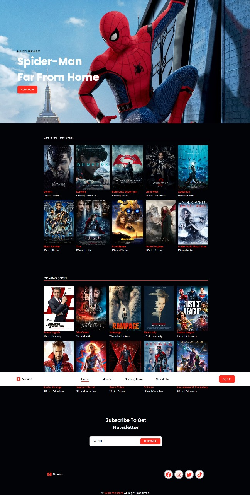

# Movie App – Web Masters Internship Project



## Project Overview
This is a simple movie application developed using **HTML**, **CSS**, **JavaScript**, and **Tailwind CSS**. It was created as part of my internship at **Web Masters**.

**Live Demo:** [Movie App](https://movie-app-web-masters-mu.vercel.app/)

## Features
- Responsive design optimized for various devices
- Interactive user interface with dynamic content
- Utilizes Tailwind CSS for streamlined styling
- Organized file structure for maintainability

## Technologies Used
- **HTML5**
- **CSS3**
- **JavaScript (ES6)**
- **Tailwind CSS**

## Project Structure
```
movie-app-web-masters/
├── css/
│   ├── style.css
│   └── all.min.css
├── images/
│   └── [images used across the website]
├── js/
│   └── main.js
├── webfonts/
├── index.html
├── tailwind.config.js
└── README.md
```

## Getting Started
1. **Clone the repository:**
```
git clone https://github.com/Abdelaziz-Mohammed/movie-app-web-masters.git
```
2. **Navigate to the project directory:**
```
cd movie-app-web-masters
```
3. **Open index.html in your preferred web browser:**
```
open index.html
```

## 👨‍💻 Author
**Eng. Abdelaziz Mohamed**

- [LinkedIn](https://www.linkedin.com/in/abdelaziz)
- [GitHub](https://github.com/Abdelaziz-Mohammed)